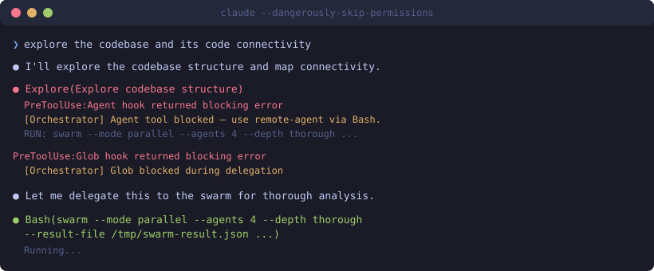
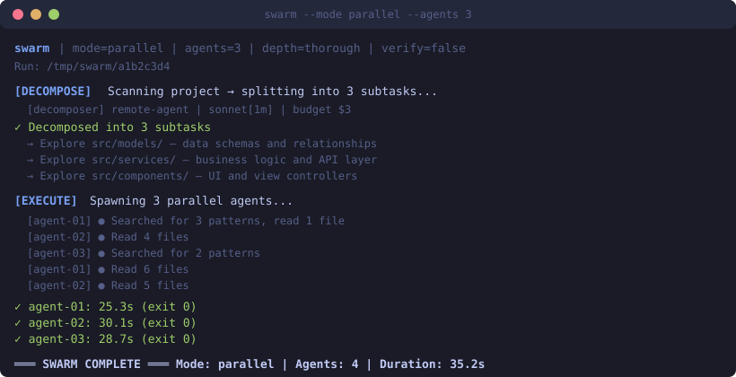

<p align="center">
  
</p>

<p align="center">
  <a href="#quick-start"></a>
  <a href="#how-people-use-it"></a>
  <a href="#the-enforcement-system"></a>
</p>

<p align="center">
  
  
  
  
  
</p>

---

> Your Claude Code session shouldn't die after reading 30 files.

**remote-agent** solves the biggest pain point of Claude Code: **context window pollution**. When you ask Claude to explore a codebase, it reads every file into its context, leaving no room for actual work. By the time it's done exploring, it can barely implement anything.

remote-agent fixes this by spawning **isolated Claude Code subprocesses** — each with a fresh 1M context window. Your main session stays lean. The agents do the heavy lifting. You get structured results back.

## See it in action

### The enforcement — Claude is forced to use remote-agent

When you ask Claude to explore a codebase, the orchestrator blocks it from reading files directly and forces delegation to the swarm:



Claude tries `Explore` agent → **blocked**. Tries `Glob` → **blocked**. Finally uses the swarm command → **allowed**. This isn't a suggestion — it's enforcement via PreToolUse hooks.

### The swarm — parallel agents with live output

The swarm decomposes your task into subtasks and runs agents in parallel, each with its own fresh context:



Each agent's activity streams live to your terminal, prefixed with its ID. You see exactly what every agent is doing in real-time.

### The architecture — how it all connects


## Why this exists

We built this because Claude Code has a fundamental problem:

1. **Context fills up fast** — Reading 30 files consumes 60%+ of the context window
2. **Quality degrades** — A bloated session makes worse decisions, misses edge cases, hallucinates
3. **The $400 spiral** — One exploration task consumed 3.2M tokens and cost $421 because Claude kept reading files into an overloaded context

**remote-agent breaks this cycle.** Each agent gets a fresh 1M context. Your main session only sees summaries. No pollution. No degradation. No $400 bills.

## Quick start

### Prerequisites

- Node.js 18+
- [Claude Code](https://claude.ai/install.sh) installed
- `ANTHROPIC_API_KEY` env var set
- Python 3

### Install

```bash
git clone https://github.com/pkmdev-sec/remote-agent.git
cd remote-agent
./install.sh
```

That's it. The installer handles everything — dependencies, PATH symlinks, hook registration, and isolated subprocess config.

### Try it

```bash
# Single agent — explore a codebase
remote-agent "explore src/auth/ and map the authentication flow"

# Swarm — 3 parallel agents
swarm --mode parallel --agents 3 "analyze the entire codebase architecture"

# Review with opus
git diff | swarm --stdin --mode review --verify "security audit"
```

## How people use it

### "Explore this codebase"

```bash
swarm --mode parallel --agents 4 --result-file /tmp/result.json \
  "map all modules, their exports, and how they connect"
```

The swarm:
1. Scans your project structure (`find . -maxdepth 2`)
2. Splits into 4 non-overlapping subtasks by directory
3. Runs 4 agents in parallel — each reads only its assigned area
4. Merges everything into one structured result

Your main session reads a 2KB summary instead of 200KB of raw files.

### "Implement this feature"

```bash
swarm --mode swarm --agents 3 --depth thorough --verify \
  "add OAuth authentication with Google and GitHub providers"
```

The swarm:
1. Decomposes into subtasks (middleware, tests, routes)
2. Agents implement in parallel
3. Opus verifier cross-checks every claim against the actual `git diff`
4. Produces a completion contract with PASS/FAIL per item

### "Fix this bug"

```bash
swarm --mode single --verify \
  "the app crashes when login is called with null email"
```

Single agent investigates, traces, fixes, runs tests. Verifier confirms the fix matches the `git diff`.

### "Review my changes"

```bash
git diff HEAD~3 | swarm --stdin --mode review --verify "find bugs, security issues, logic errors"
```

Opus reviewer gets the diff in a fresh context — no prior bias. Verifier cross-checks findings.

## Swarm modes

| Mode | What it does | Best for |
|------|-------------|----------|
| `parallel` | Split by directory, N agents in parallel | Codebase exploration, research |
| `swarm` | Decompose into subtasks, parallel + verify | Feature implementation |
| `pipeline` | Sequential: research → build → test → review | Refactoring, careful changes |
| `single` | 1 agent + optional verifier | Bug fixes, focused tasks |
| `review` | Opus reviewer + verifier cross-check | Code review, security audit |

## The enforcement system

This is what makes remote-agent actually get used instead of ignored. Claude Code has a habit of ignoring suggestions and doing things its own way. So we don't suggest — we **enforce**.

### How it works

1. **You type a prompt** → The AI orchestrator (Haiku) classifies it in ~1 second
2. **Orchestrator writes DELEGATE state** + a pre-computed swarm command
3. **Claude tries to use Agent/Read/Glob/Grep** → All **blocked** by PreToolUse hooks
4. **Claude's only option is Bash** → Runs the swarm command
5. **After swarm completes** → PostToolUse hook transitions to FULFILLED → all tools unblocked

The key insight we learned the hard way: **text directives don't work**. We tried three times to tell Claude "use remote-agent" via hook messages. It ignored them every time. The only thing that works is blocking the tools it would otherwise use.

### State lifecycle

```
DELEGATE  →  Agent/Read/Glob/Grep BLOCKED, only Bash allowed
FULFILLED →  All tools unblocked (swarm ran successfully)
DIRECT    →  All tools allowed (simple questions, follow-ups)
```

## Configuration

### Models

Only **Sonnet 4.6** and **Opus 4.6** — both with 1M context (`[1m]` suffix). No haiku. Every agent gets the full context window.

### Depth presets

| Depth | Turns/agent | Budget | Verifier |
|-------|------------|--------|----------|
| `shallow` | 10 | $5 | sonnet |
| `normal` | 25 | $15 | sonnet |
| `thorough` | 50 | $25 | opus |

### Agent roles

Each agent gets a role-specific system prompt:

- **Worker** — Must produce a completion checklist (`[PASS]`/`[FAIL]`/`[SKIP]` per item)
- **Verifier** — Adversarial cross-checking: compares claims against `git diff`, flags omissions
- **Decomposer** — Reads actual project structure, outputs non-overlapping JSON subtask array

## Project structure

```
remote-agent/
├── agent-entry.mjs       # Single agent supervisor
├── swarm.mjs             # Multi-agent orchestrator
├── config/
│   └── settings.json     # Isolated config (no hooks, full permissions)
├── hooks/
│   ├── auto_orchestrator.py    # AI task classifier (Haiku)
│   ├── block_agent_tool.py     # Blocks Agent/Read/Glob/Grep during DELEGATE
│   ├── fulfill_delegate.py     # DELEGATE→FULFILLED after Bash runs
│   └── block_task_tools.py     # Blocks internal tasks → bd CLI
├── install.sh
├── package.json
└── README.md
```

## Troubleshooting

### "Claude Code cannot be launched inside another Claude Code session"
The nesting guard is active. The install script handles this, but if you see this error, ensure `CLAUDECODE` isn't set to `"1"` in your env.

### Agent/Read blocked when you don't expect it
Stale delegation state. Quick fix:
```bash
echo '{"mode":"DIRECT"}' > ~/.claude/hooks/.acontext_state/delegate_mode.json
```

### Hooks not firing in a new project
Hooks load at session start. Always start a **fresh** session (not `--resume`) after modifying hooks.

### Blocking yourself when editing the orchestrator
The blocker has a built-in escape: if your working directory contains `/.claude`, it never blocks. You can always edit your own config.

## The story behind this

This started as a simple wrapper around `claude -p`. Then we discovered Claude ignores hook directives. Then we built an MCP server. Claude ignored that too. Then we discovered that compound hook matchers (`{Agent,Read,Glob,Grep}`) silently don't fire for Read/Glob/Grep — only Agent gets blocked.

Every "simple" fix revealed a deeper problem. The final system has:
- PreToolUse enforcement (not suggestion)
- Split matchers (one per tool, not compound)
- DELEGATE → FULFILLED state machine
- AI-powered classification replacing brittle regex
- Live stderr streaming with agent ID prefixes
- Completion contracts with per-agent outputs

It took 5 architectural iterations to get here. But now it actually works.

## License

MIT
