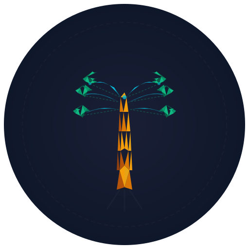
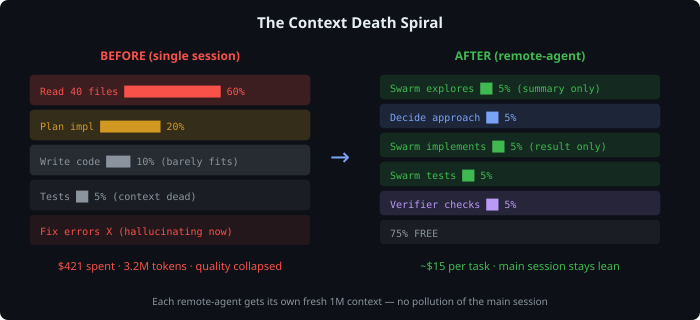
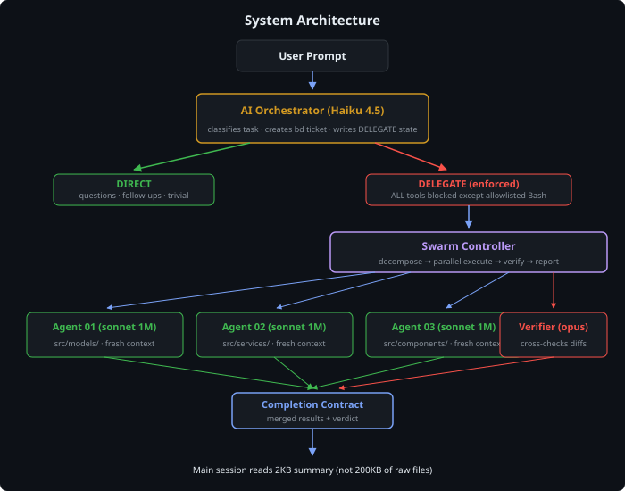
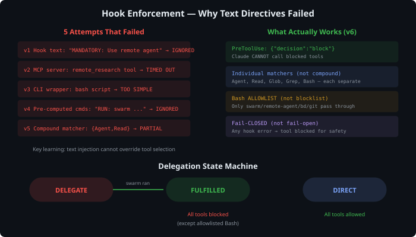
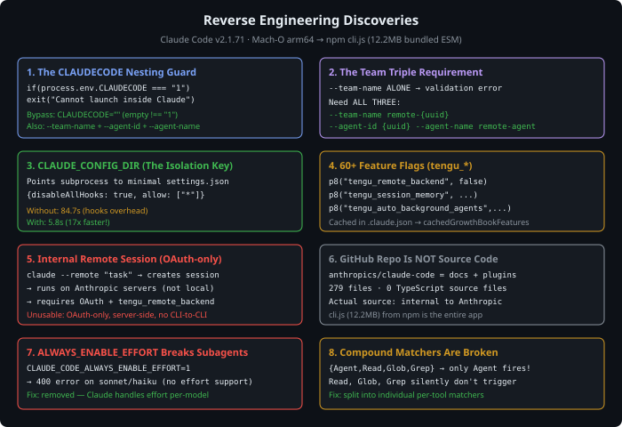

<p align="center">
  
</p>

<h1 align="center">remote-agent</h1>

<p align="center">
  <strong>Autonomous Claude Code executor with parallel swarm orchestration</strong><br/>
  <sub>Fresh 1M context per agent · AI routing · Hook enforcement · Completion contracts</sub>
</p>

<p align="center">
  
  
  
  
  
</p>

---

## The Problem

Claude Code sessions die after reading 30 files. Context fills, quality collapses, costs spiral.

<p align="center"></p>

## The Solution

Spawn isolated Claude Code subprocesses — each with a fresh 1M context. Main session orchestrates. Agents execute.

<p align="center"></p>

## Install

```bash
git clone https://github.com/pkmdev-sec/remote-agent.git
cd remote-agent
./install.sh
```

## Usage

```bash
# Single agent
remote-agent "explore src/auth/ and map the authentication flow"

# Parallel swarm (3 agents, auto-decompose by directory)
swarm --mode parallel --agents 3 "analyze the entire codebase"

# Full swarm with verification
swarm --mode swarm --verify "implement OAuth with Google and GitHub"

# Pipeline (sequential: research → implement → test → review)
swarm --mode pipeline --verify "refactor the database layer"

# Code review with opus
git diff | swarm --stdin --mode review --verify "security audit"
```

## Swarm Modes

| Mode | Pattern | Use Case |
|------|---------|----------|
| `parallel` | Decompose by directory → N agents → merge | Exploration |
| `swarm` | Decompose → parallel → opus verify | Implementation |
| `pipeline` | Research → Build → Test → Review | Refactoring |
| `single` | 1 agent + verifier | Bug fixes |
| `review` | Opus reviewer + verifier | Code review |

## How Enforcement Works

Text directives don't work — Claude ignores them. We learned this after 5 failed attempts. The only thing that works: **blocking the tools Claude would otherwise use**.

<p align="center"></p>

During delegation, only `remote-agent`, `swarm`, `bd`, `git`, and test commands pass through Bash. Everything else — Agent, Read, Glob, Grep, Write, Edit, even `Bash(cat)` — is blocked.

## What We Discovered

This project was built on 8 reverse-engineering discoveries from Claude Code v2.1.71's binary:

<p align="center"></p>

## Agent Roles

| Role | Job | Output |
|------|-----|--------|
| **Worker** | Execute task thoroughly | Completion checklist (PASS/FAIL/SKIP) |
| **Verifier** | Cross-check claims vs `git diff` | VERDICT: PASS / FAIL / NEEDS_REWORK |
| **Decomposer** | Scan project, split into subtasks | JSON array of non-overlapping tasks |

## Project Structure

```
remote-agent/
├── agent-entry.mjs       # Single agent supervisor
├── swarm.mjs             # Multi-agent orchestrator
├── config/settings.json  # Isolated subprocess config
├── hooks/
│   ├── auto_orchestrator.py    # AI classifier (Haiku)
│   ├── block_agent_tool.py     # Tool enforcer (Bash allowlist)
│   ├── fulfill_delegate.py     # State transition hook
│   └── block_task_tools.py     # Task tool redirect
├── install.sh
└── package.json
```

## Requirements

- Node.js 18+ · [Claude Code](https://claude.ai/install.sh) · `ANTHROPIC_API_KEY` · Python 3

## License

MIT
