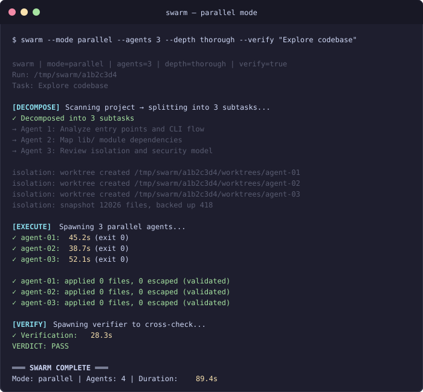
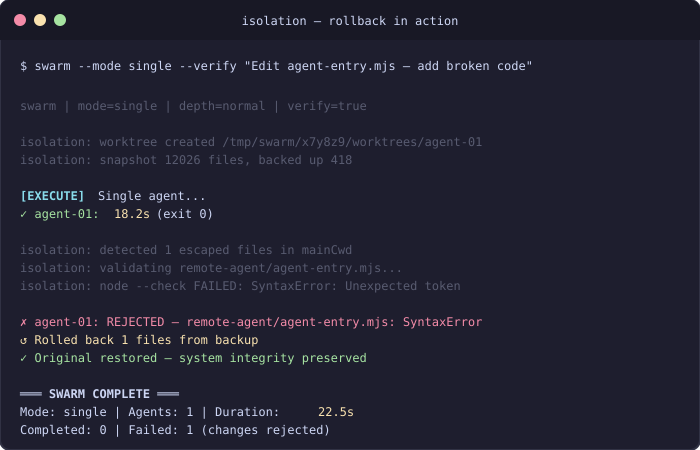

<div align="center">
  
  <h1>remote-agent</h1>
  <p><strong>Multi-agent orchestration for Claude Code</strong></p>
  <p>Spawn isolated agents with fresh context windows. Decompose → Execute → Verify → Apply.</p>
</div>

## In Action

### Parallel Swarm Execution


### Isolation Rollback Protection


## Architecture


- **Main session delegates** to swarm via hooks — agents get fresh 200K context, isolated config
- **Worktree isolation** prevents cross-contamination between parallel agents
- **Verifier** cross-checks agent claims against actual `git diff`
- **Completion contracts** give the main session a structured JSON summary

## Modes


| Mode | Agents | Use Case |
|------|--------|----------|
| `single` | 1 | Bug fixes, focused tasks |
| `parallel` | 2–5 | Research, exploration |
| `pipeline` | 4 stages | Feature implementation (research → implement → test → review) |
| `swarm` | 2–5 + verify | Large implementations with verification |
| `review` | 1 + verify | Code review, security audits |

## Isolation


1. **Snapshot** — SHA-256 fingerprint of all files before agent runs (escape detection baseline)
2. **Worktree** — Git worktree + untracked file copy per agent, `node_modules/` symlinked
3. **Rollback** — Syntax validation (`node --check`, `py_compile`) on all changes; failures → restore from backup

## Quick Start

```bash
npm install                # requires @anthropic-ai/claude-code

# Single agent
remote-agent "explore the auth module"

# Parallel research
swarm --mode parallel --agents 3 "analyze the codebase"

# Implementation with verification
swarm --mode swarm --verify "implement user authentication"

# Pipeline (research → implement → test → review)
swarm --mode pipeline "refactor the auth system to use JWT"

# Code review
git diff | remote-agent --stdin "review for bugs and security issues"
```

## Module Structure

```
lib/
├── output.mjs         → colors, log, quiet mode
├── config.mjs         → models, roles, depth presets
├── cli.mjs            → argument parsing & help
├── telemetry.mjs      → tool call & checklist tracking
├── context-bridge.mjs → context file ↔ system prompt
├── agent-spawn.mjs    → subprocess spawning
├── lifecycle.mjs      → bd tasks, cleanup
├── isolation.mjs      → snapshot, worktree, rollback
└── orchestration.mjs  → decompose, parallel, pipeline, verify
```

Entry points: `agent-entry.mjs` (single agent) · `swarm.mjs` (multi-agent orchestrator)

## CLI Reference

### `remote-agent`

| Flag | Default | Description |
|------|---------|-------------|
| `-m, --model` | `sonnet` | `sonnet` (4.6) or `opus` (4.6), both 1M context |
| `-b, --budget` | `15` | Max budget in USD (1–100) |
| `-t, --timeout` | `600` | Timeout in seconds (10–3600) |
| `-n, --turns` | `50` | Max tool-use turns (1–200) |
| `-s, --system` | — | Append custom system prompt |
| `--context-file` | — | Structured context JSON input |
| `--result-file` | — | Structured result JSON output |
| `--stdin` | — | Read task/diff from stdin |
| `--max-retries` | `0` | Retry on non-timeout failures |
| `-q, --quiet` | — | Suppress status output |

### `swarm`

| Flag | Default | Description |
|------|---------|-------------|
| `--mode` | `auto` | `single` · `parallel` · `pipeline` · `swarm` · `review` |
| `--agents` | `3` | Parallel agent count (1–5) |
| `--depth` | `normal` | `shallow` (10 turns/$5) · `normal` (25/$15) · `thorough` (50/$25) |
| `--timeout` | `600` | Per-agent timeout in seconds |
| `--verify` | auto | Force verification (auto for swarm/pipeline/review) |
| `--no-verify` | — | Skip verification |
| `--result-file` | — | Write full contract JSON |
| `--context-file` | — | Pass context to all agents |
| `--bd-task` | — | Beads task ID for lifecycle tracking |

## License

MIT
