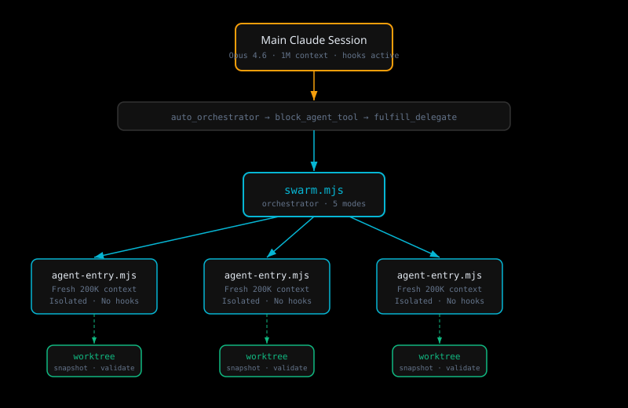
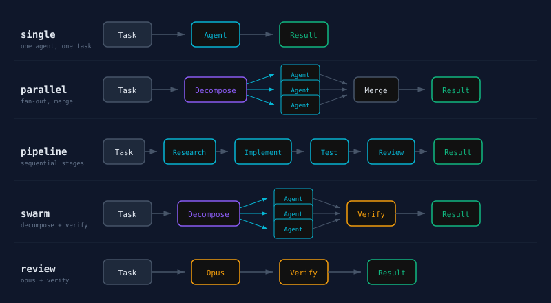
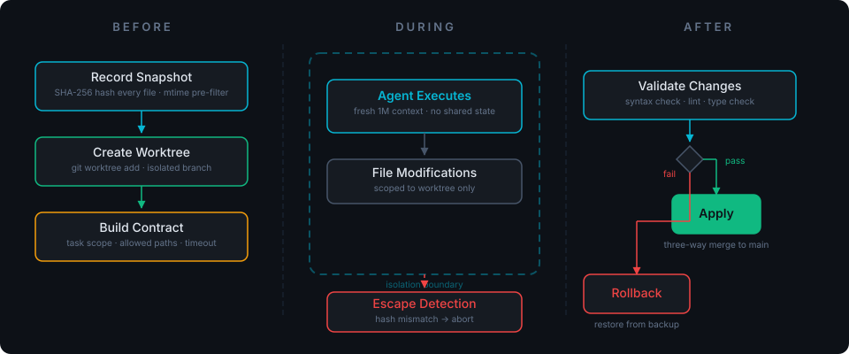
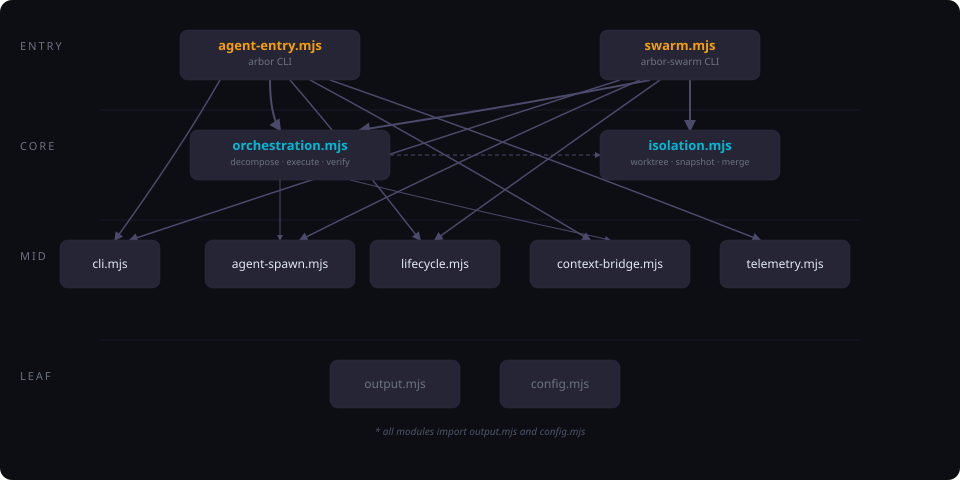

<div align="center">
  
</div>

---

Arbor spawns isolated Claude Code agents — each with a fresh 1M token context window and its own git worktree — then merges their work back together. You describe a task; Arbor breaks it apart, runs the pieces in parallel, validates the output, and applies the results.

The name comes from the Latin word for *tree*. Every agent is a branch: forked from the trunk, isolated while it works, merged when it's done.

## How it works



A task enters through your Claude Code session. Hooks intercept it and route it to the arbor-swarm orchestrator, which decomposes it into independent subtasks. Each subtask runs in a separate agent process with its own worktree — a full copy of the repo where the agent can read, write, and run commands without stepping on anyone else's work.

When the agents finish, Arbor snapshots the worktree state (SHA-256 hashes of every file), validates syntax, runs a three-way merge against the main working directory, and either applies the changes or rolls back.

## Quick start

```bash
# Install
git clone <repo-url> && cd arbor
./install.sh

# Single agent
arbor "explore the auth module"
arbor -m opus "refactor the error handling in lib/"

# Multi-agent
arbor-swarm --mode parallel --agents 3 "analyze the codebase"
arbor-swarm --mode swarm --verify "implement feature X"
arbor-swarm --mode pipeline "refactor the API layer"

# Code review from a diff
git diff | arbor-swarm --stdin --mode review --verify
```

## Execution modes



| Mode | Agents | Pattern | Best for |
|------|--------|---------|----------|
| `single` | 1 | Direct execution | Focused tasks, exploration |
| `parallel` | 2-5 | Fork, execute, merge | Independent changes across files |
| `pipeline` | 2-5 | Sequential stages | Research, implement, test, review |
| `swarm` | 2-5 | Fork, execute, **verify**, merge | High-stakes changes needing validation |
| `review` | 1 | Opus + verify pass | Code review with adversarial checking |

The orchestrator picks a mode automatically based on task complexity, or you can force one with `--mode`.

## Isolation model



Each agent gets three layers of protection:

1. **Worktree isolation** — `git worktree add` gives each agent a full repo copy. No shared mutable state between agents.
2. **Snapshot validation** — SHA-256 hashing before and after execution. Hash mismatches outside the agent's scope flag an isolation escape.
3. **Syntax-gated merge** — Changes only land in the main directory if they parse cleanly. Failed validation triggers a full rollback from backup.

## Modules

```
arbor/
├── agent-entry.mjs        CLI supervisor
├── swarm.mjs              Orchestrator (arbor-swarm)
└── lib/
    ├── orchestration.mjs   Decompose, execute, verify, merge
    ├── isolation.mjs       Snapshot, validate, apply, rollback
    ├── agent-spawn.mjs     Subprocess management
    ├── config.mjs          Models, roles, depth presets
    ├── cli.mjs             Argument parsing, help text
    ├── context-bridge.mjs  Context file <-> system prompt
    ├── lifecycle.mjs       Task tracking, cleanup
    ├── telemetry.mjs       Tool call and memory tracking
    └── output.mjs          TTY-aware colors, logging
```



## CLI reference

### `arbor`

| Flag | Default | Description |
|------|---------|-------------|
| `-m, --model` | `sonnet` | Model: `sonnet` or `opus` (both get 1M context) |
| `-b, --budget` | `15` | Max budget in USD |
| `-t, --timeout` | `600` | Timeout in seconds |
| `-n, --turns` | `50` | Max tool-use turns |
| `--result-file` | - | Write JSON result to file |
| `--context-file` | - | Read structured context from file |
| `--stdin` | - | Read task from stdin |
| `--max-retries` | `0` | Retry on failure (opt-in) |
| `-q, --quiet` | - | Suppress status output |

### `arbor-swarm`

| Flag | Default | Description |
|------|---------|-------------|
| `--mode` | `auto` | `single` / `parallel` / `pipeline` / `swarm` / `review` |
| `--agents` | `3` | Max parallel agents (1-5) |
| `--depth` | `normal` | `shallow` / `normal` / `thorough` |
| `--verify` / `--no-verify` | auto | Force or skip verification pass |
| `--result-file` | - | Write JSON contract to file |
| `--timeout` | `600` | Per-agent timeout in seconds |
| `--bd-task` | - | Beads task ID for tracking |

### Depth presets

| Preset | Turns | Budget | Verify model |
|--------|-------|--------|-------------|
| `shallow` | 10 | $5 | Sonnet |
| `normal` | 25 | $15 | Sonnet |
| `thorough` | 50 | $25 | Opus |

## Hooks

Arbor ships four Claude Code hooks that run inside your main session:

- **auto_orchestrator.py** — Classifies incoming prompts and routes to Arbor when appropriate
- **block_agent_tool.py** — Prevents raw agent spawning, forces orchestrated routing
- **fulfill_delegate.py** — Detects delegated command completion and transitions state
- **block_task_tools.py** — Redirects task management to the `bd` CLI

## Documentation

| Doc | What it covers |
|-----|----------------|
| [Architecture](docs/architecture.md) | System design, data flow, module responsibilities |
| [Concepts](docs/concepts.md) | Fork-join, worktree isolation, snapshot validation, three-way merge |
| [Usage](docs/usage.md) | Installation, configuration, examples, troubleshooting |
| [Modes](docs/modes.md) | Deep dive into each execution mode with flow diagrams |
| [Hooks](docs/hooks.md) | Hook system, state machine, customization |

## License

MIT
