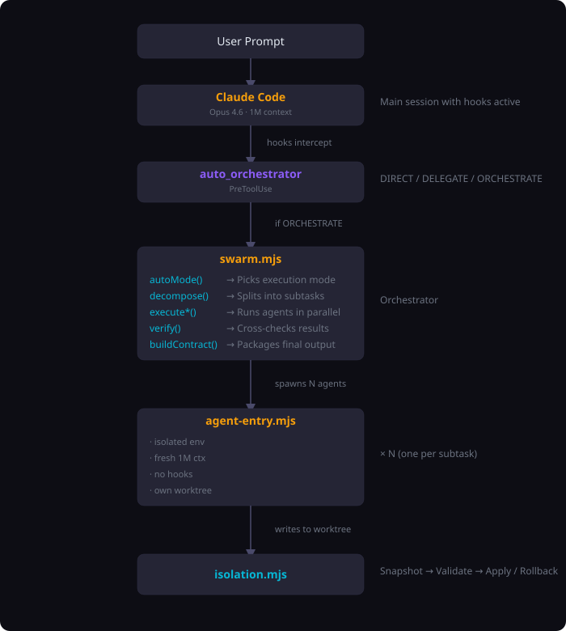

# Architecture

## Overview

Arbor is a two-layer system:

- **Supervisor** (`agent-entry.mjs`): manages one Claude Code subprocess. Handles spawning, output capture, retry, and result extraction.
- **Orchestrator** (`swarm.mjs`): coordinates multiple supervisors. Handles decomposition, parallel execution, verification, and merge.

Neither layer knows the other's internals. The supervisor exposes a contract: task string + config in, JSON result out. The orchestrator consumes that contract to run multiple supervisors concurrently.

## Data flow

## Module responsibilities

### Entry points

| Module | Role |
|--------|------|
| `agent-entry.mjs` | Single-agent supervisor. Resolves CLI path, parses args, spawns subprocess, manages retry loop, writes result file. Binary: `arbor` |
| `swarm.mjs` | Multi-agent orchestrator. Parses swarm args, selects execution mode, runs decompose-execute-verify-merge pipeline. Binary: `arbor-swarm` |

### Core

| Module | Responsibilities |
|--------|-----------------|
| `orchestration.mjs` | `autoMode()` picks execution mode. `scoutProject()` recons the repo. `decompose()` splits tasks. `executeParallel()` / `executePipeline()` runs agents. `verify()` cross-checks. `buildContract()` packages output. |
| `isolation.mjs` | `snapshotFiles()` SHA-256 hashes with mtime pre-filter. `backupFiles()` copies originals. `validateAndApply()` syntax-checks, three-way merges, rollback on failure. |

### Supporting

| Module | Role |
|--------|------|
| `config.mjs` | Model aliases, role prompts (worker/verifier/decomposer), depth presets |
| `cli.mjs` | Argument parsing with Levenshtein typo correction, help text |
| `agent-spawn.mjs` | `child_process.spawn` wrapper, clean env via `Object.create(null)`, 50MB stdout cap |
| `context-bridge.mjs` | Converts structured context files (JSON) ↔ system prompt text |
| `lifecycle.mjs` | Process cleanup (SIGINT/SIGTERM), beads task tracking, stale run cleanup |
| `telemetry.mjs` | Tool call counts, memory high-water marks per agent |
| `output.mjs` | TTY-aware ANSI colors, stderr logging |

## Process isolation

Every agent subprocess runs with these guarantees:

| Guarantee | How |
|-----------|-----|
| Fresh 1M context | No bleed-through from parent or other agents |
| No hooks | `disableAllHooks: true` prevents recursive orchestration |
| Clean env | `Object.create(null)` base prevents variable leakage |
| Own worktree | `git worktree add` provides a full repo copy |
| Scoped file access | Each task specifies allowed files |
| Budget + timeout caps | Hard limits prevent runaway execution |
